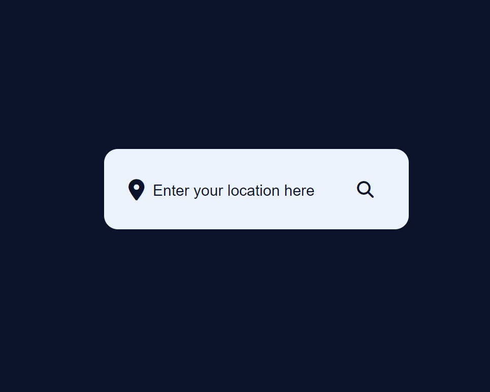
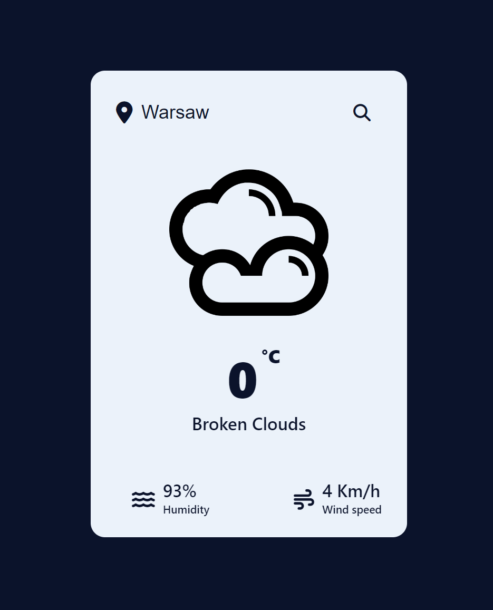
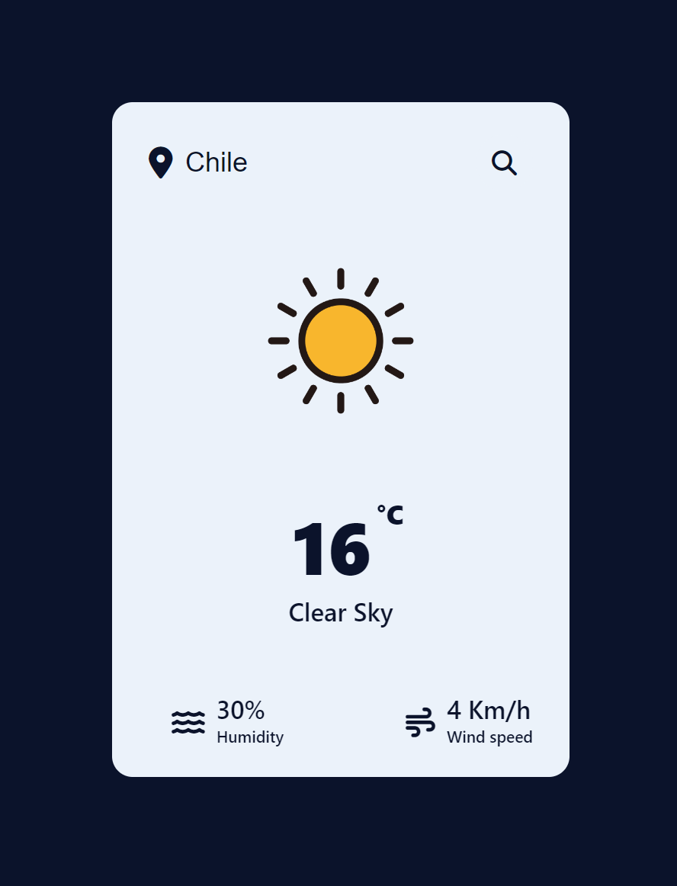

# weatherApp
<h2>A simple weather app utilizes the OpenWeatherMap API to provide real-time weather information</h2>

<a href="https://m-szczepanski.github.io/weatherApp/">Link to the app</a>
<h3>The application was written using pure HTML, CSS, and JavaScript. The weather data is retrieved using the OpenWeatherMap API</h3>
<h4>Idle state of the application</h4>
  
<h4>The result after entering 'Warsaw' in the search bar:</h4>
  
<h4>The result after entering 'Chile' in the search bar:</h4>
  

<h4>No additional libraries were used - only HTML, CSS, and JavaScript.</h4>
